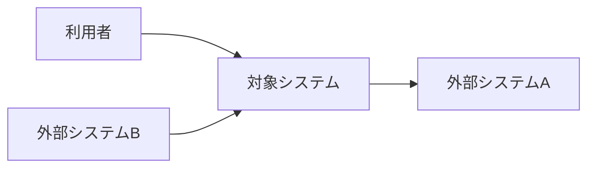
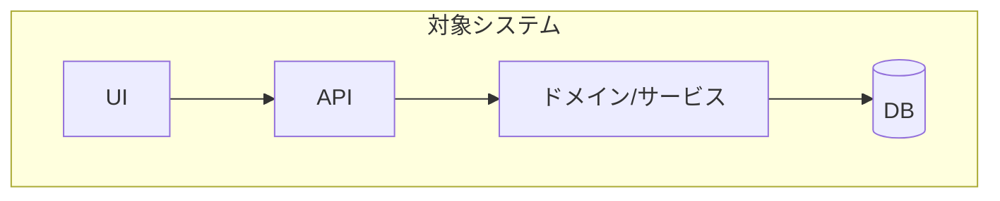
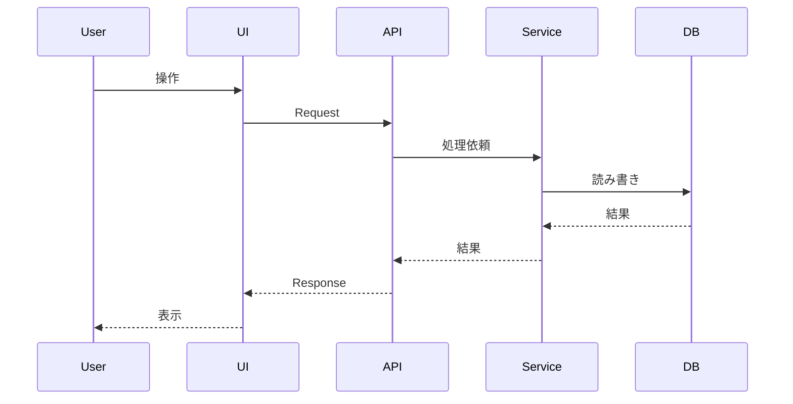
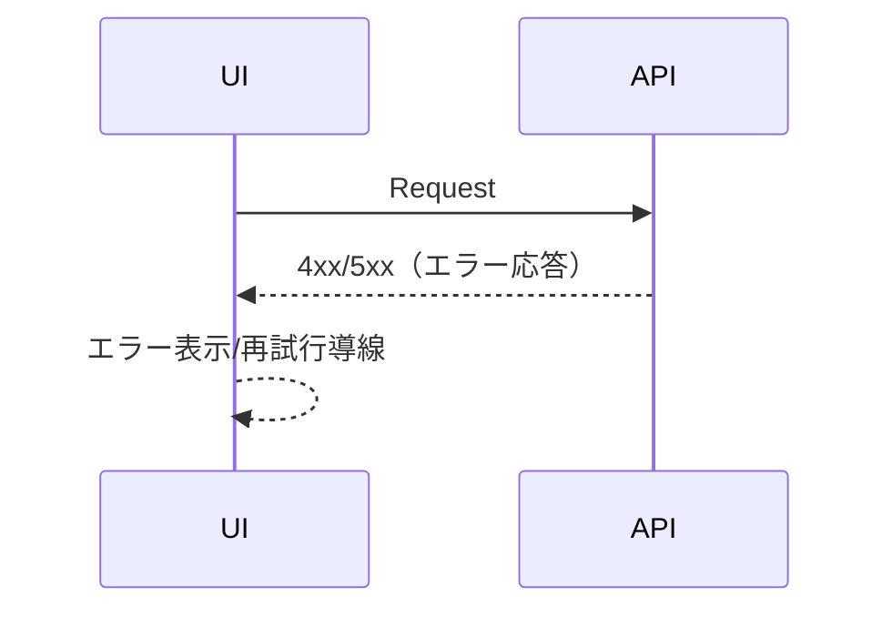

# Mermaid 図テンプレ（必要最小限）

## System Context（コンテキスト図）

```mermaid
flowchart LR
  User[利用者] --> System[対象システム]
  System --> Ext1[外部システムA]
  Ext2[外部システムB] --> System
```

## Component（コンポーネント図）

```mermaid
flowchart TB
  subgraph System[対象システム]
    UI[UI]
    API[API]
    Domain[ドメイン/サービス]
    DB[(DB)]
  end
  UI --> API --> Domain --> DB
```

## Sequence（シーケンス図：成功系）

```mermaid
sequenceDiagram
  participant U as User
  participant UI as UI
  participant API as API
  participant S as Service
  participant DB as DB
  U->>UI: 操作
  UI->>API: Request
  API->>S: 処理依頼
  S->>DB: 読み書き
  DB-->>S: 結果
  S-->>API: 結果
  API-->>UI: Response
  UI-->>U: 表示
```

## Sequence（シーケンス図：失敗系の最小例）

```mermaid
sequenceDiagram
  participant UI as UI
  participant API as API
  UI->>API: Request
  API-->>UI: 4xx/5xx（エラー応答）
  UI-->>UI: エラー表示/再試行導線
```

